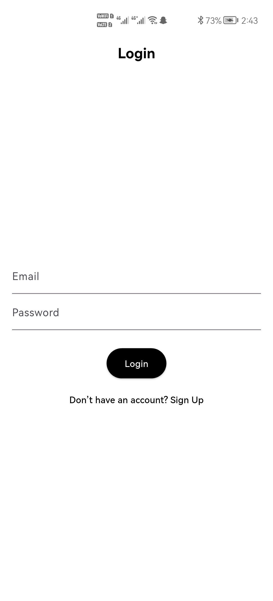
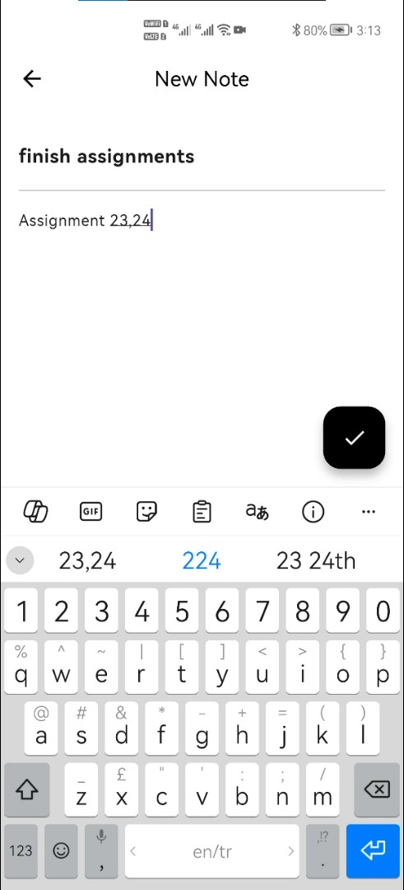
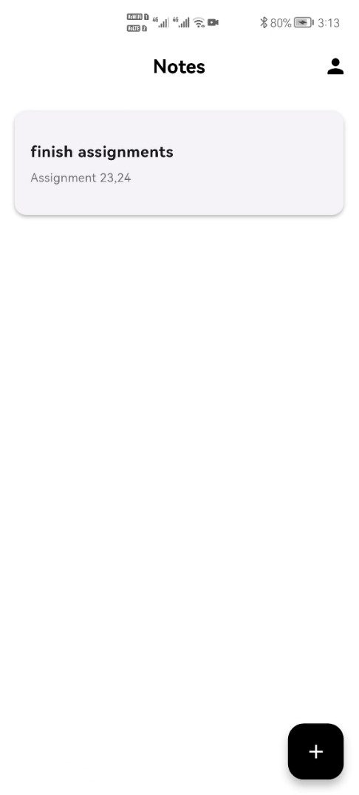
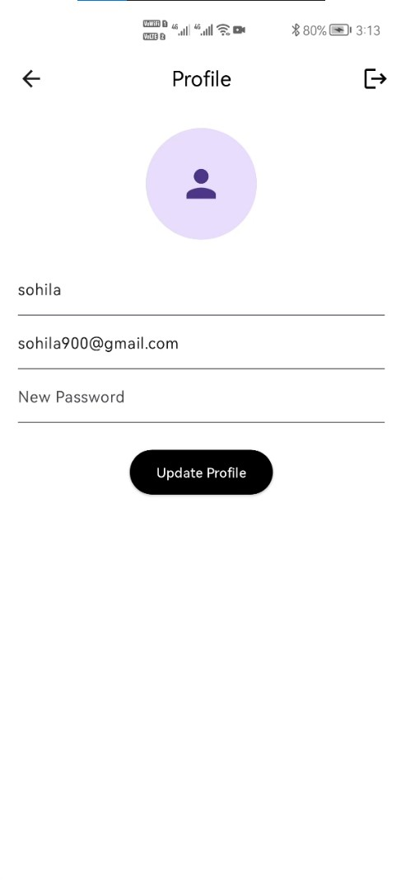
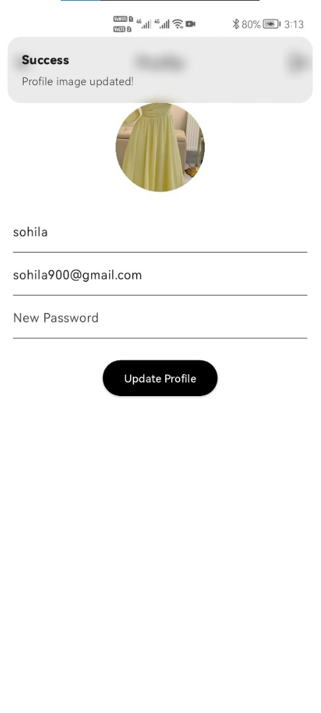

# 📝 NoteApp

A Flutter application for managing notes with Firebase and Supabase integration.

## 🚀 Features
- User authentication (Firebase)
- Cloud-based note storage (Supabase)
- Real-time updates and responsive UI

## 📱 App Screenshots

  
  
  
  
  

## 🧰 Tech Stack
Flutter • Dart • Firebase • Supabase • Provider

## 📫 Author
**Sohila Khaled**  
[LinkedIn](https://www.linkedin.com/in/sohaila-ahmed-a23214305) | [Email](mailto:sokhaleed@gmail.com)
